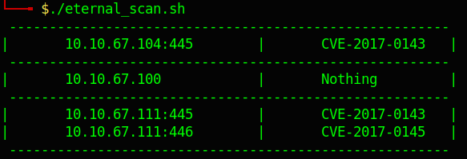

## Как это работает?
Сканирование производится с помощью Nmap.

Сканирование выполняется с целью определения уязвимости хоста к CVE-2017-0143-CVE-2017-0148, для этого используются специальные скрипты, лижещие по следующиему пути **/usr/share/nmap/scripts/smb***.

На основании результатов сканирования строится таблица.

## Результат сканирования

